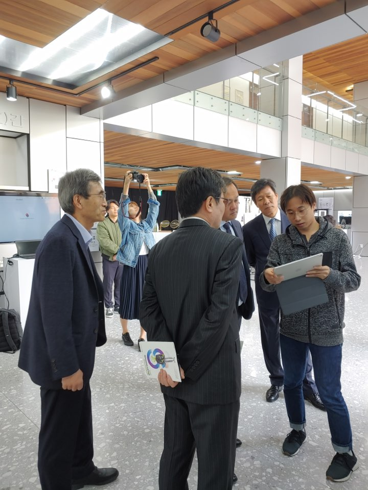

# To efficiently pricing Deep Learning Inference System on Serverless
##  Motivation
In this project, Server based Pattern Image Analysis using Deep learning System migrate to fully managed service of serverless platform. 

## Architecture

## Pre-required
It platform must use runtime of *python3.6+*.
Note that you should be understood the limit of FaaS like AWS Lambda, Google Function, Azure Function. 
Since the resources limit of AWS Lambda, we should be choose the low-version deep learning framework and candidate *Pytorch-1.0*. 
And then, we had been implemented of KNN mining system using *Scikit-Learn* that involved scipy. 
 
As well, You have to build RESTful Endpoint using *AWS API Gateway*, that need for CORS(cross origin resource sharing) because our system prefer to use web application leveraged *Ajax*. 
If you want to see the our web application, please check in followed link.  
[Our WebApp Link](https://s3.ap-northeast-2.amazonaws.com/crc.kmubigdata.cloud/index.html)

*Summary:* 
Pytorch3.6+  
AWS Lambda base  
AWS API gateway base  
AWS S3 to build your web app 
Ajax ( Asynchronous JavaScript and XML )

## Contributor
Hyunjune Kim. - email is '4u_olion@naver.com' 
Kyungyong Lee. - my professor is him, an assistant professor in Kookmin University.

## Stopwatch
the StopWatch will make immediacy and readability for your code.  
create by Hyunjune KIM.

## Event

<video width="480" height="320" controls="controls">
  <source src="/fashionsearch.mp4" type="video/mp4">
</video>
